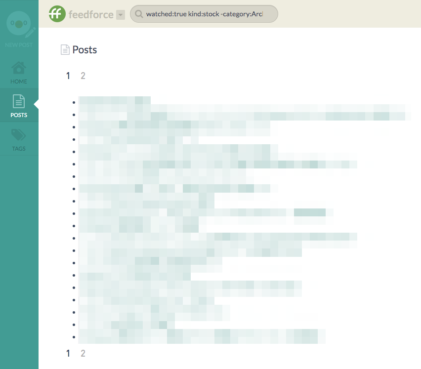

# sandbox-elm-esa

## Screenshot



## Requirements

* Elm 0.19.0

```
$ npm install -g elm
```

## Setup

1. Generate Personal access token with `Read` scope on https://{team_name}.esa.io/user/applications
1. Replace `SECRET` in src/Main.elm to the token
1. Compile src/Main.elm like the below:

```
$ elm make src/Main.elm --output main.js
```

Then you can open `index.html` to a web browser.

## TODO?

* Implement OAuth 2.0 Implicit Flow
